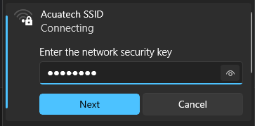
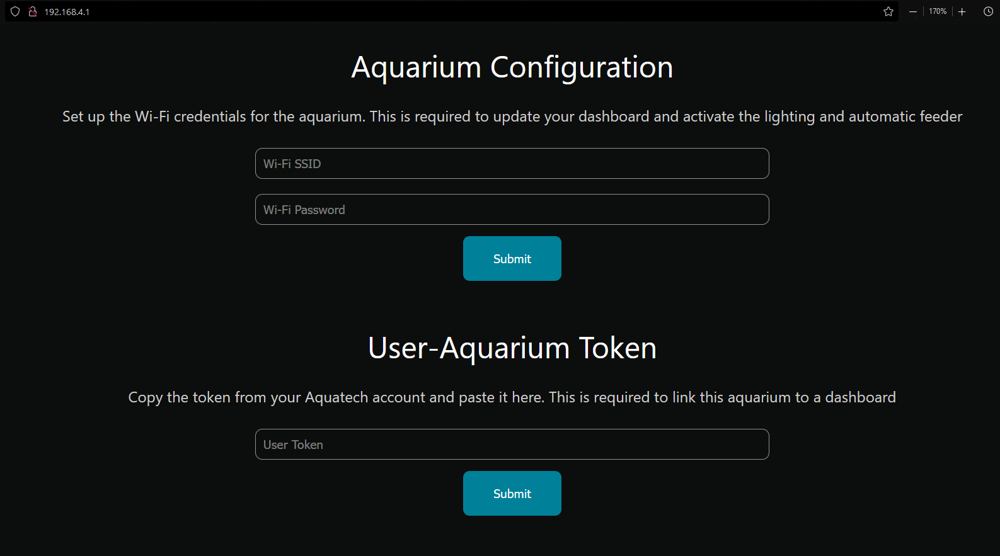
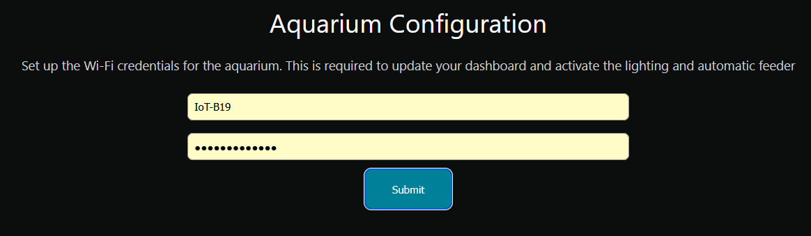
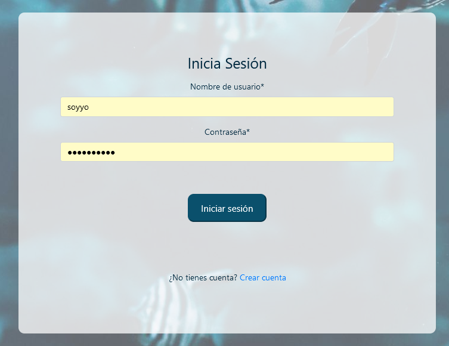
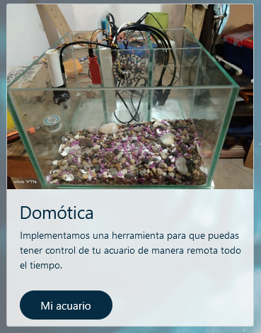
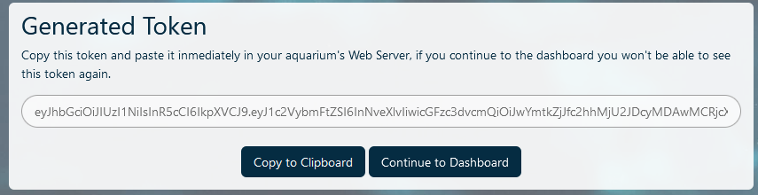
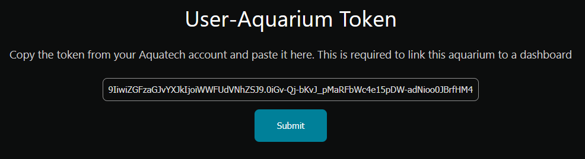
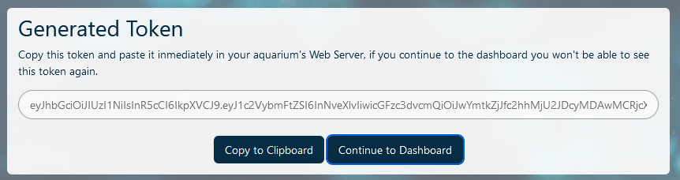

# Configure Your Aquarium

## Wi-Fi Setup

1. Connect to the aquarium's network

    

1. Go to http://192.168.4.1/

    

1. Write your Wi-Fi credentials under Aquarium Configuration and click Submit

    

1. Wait for the aquarium to restart

## Account Linking

1. Once your aquarium is connected to a Wi-Fi network, login to your Acuatech account and go to Mi acuario

    
    

1. Enter a name for your dashboard and click on generate

    

1.  Copy the generated token, this token won't be shown to you again

    

1. Repeat steps 1 and 2 from Wi-Fi Setup and under User-Aquarium Token paste the copied token and click Submit

    

1. Now back on the Acuatech website, you can click Continue to Dashboard, your account is now linked to your aquarium!

    